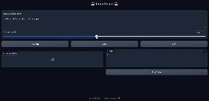

# 🧞‍♂️ CodeGenie

Turn your ideas into working code across **Python**, **Java**, and **C++** using AI!  
CodeGenie is a sleek, powerful interface built on top of CodeQwen1.5-7B-Chat.

---

✨ **Features**

- 💡 **AI-Powered Code Generation** – Turn natural language into real code
- 📦 **Multi-Language Support** – Works with Python, Java, and C++
- ⚙️ **Auto Compile & Run** – Generate and execute code instantly
- 🎨 **Modern Interface** – Clean, interactive UI powered by Gradio
- 🔍 **Smart Code Extraction** – Finds the best code snippets in AI responses

---

🛠️ **Quick Start**

```bash
# Install dependencies
pip install torch transformers gradio

# Run the app
python main.py
```

---

💻 **How to Use**
1. Describe your code idea in plain English  
2. Choose your language – Python, Java, or C++  
3. Generate & run with a single click  
4. View output, copy or save the code

---

🧠 **Under the Hood**
Built on **Qwen’s CodeQwen1.5-7B-Chat** model with smart extraction, auto-compilation, and secure execution with timeouts.

---

📝 **Example Prompts**
- "Write a Python function for factorial with recursion"
- "Create a Java class to manage a student database"
- "Generate a C++ program to implement Dijkstra’s algorithm"

---

⚠️ **Note**
Code runs locally with a 10-second timeout. Review all generated code before using it in production environments.

<p align="center">
  
</p>

